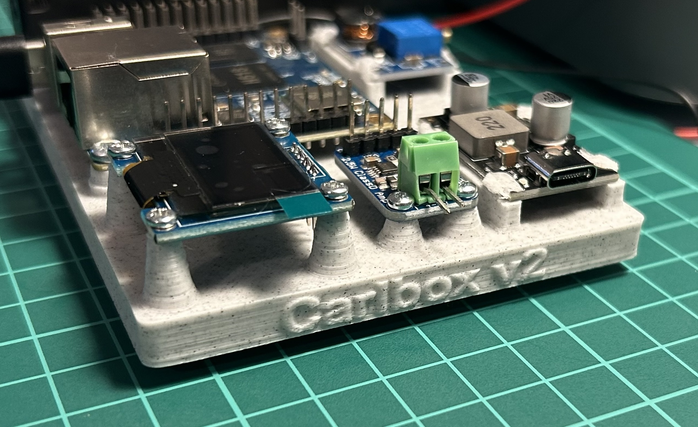

# Carlbox v2

Carlbox v2 is the next iteration of the Carlbox sampler — a small, playful device to play, on-demand, recognizable audio snippets (TV intros, iconic movie quotes, chimes, and other fun sounds) to bring smiles and a light atmosphere to the workspace.

This repository contains materials for the v2 platform which is built around an Orange Pi Zero running Alpine Linux (previous version used a Raspberry Pi 3 and Raspbian). The new hardware and software stack focuses on low power, portability, and an improved user experience.

## Key differences from v1

- Platform: Orange Pi Zero + Alpine Linux (vs Raspberry Pi 3 + Raspbian).
- Battery powered for mobile / desk placement without a permanent power cable.
- Small OLED display for quick status and feedback (battery, current sample, playback status).
- Integrated samples management system to add/remove and tag short audio snippets.
- Custom sampler software written in Go (Golang) for lightweight, efficient playback and easy cross-compilation.
- Hardware and software improvements aimed at reliability and easier maintenance.

## Status

This project is actively under development. The work in this repository is NOT yet production-ready. Expect missing features, rough edges, and frequent changes. Use the information here to experiment, contribute, and help shape the design.

## Quick start / Install the OS

See `INSTALL.md` for step-by-step instructions to prepare the Orange Pi Zero image and install the minimal Alpine Linux base used by Carlbox v2. That document includes all OS-level steps (image writing, initial configuration, networking) required before deploying the Carlbox software.

## What you'll find (planned / in-repo)

- Boot / OS notes and scripts (see `INSTALL.md`).
- Hardware photos and sketches in `img/`.
- Early Golang sampler service (playback, playlist scheduling, simple HTTP API).
- Sample management tooling (upload, list, tag, remove).
- Basic OLED and battery monitoring integration code.

## Roadmap

Short-term:
- Develop the sampler app (reliability, low memory footprint)
- Create sample management UI/API.

Medium-term:
- Add OTA updates for samples and firmware.
- Improve audio pipeline (volume normalization, crossfade, scheduling).
- Packaging and easier deployment (prebuilt images, install script).

⚠️ This README intentionally keeps high-level details minimal while the project is evolving. See `INSTALL.md` for the OS installation steps.
